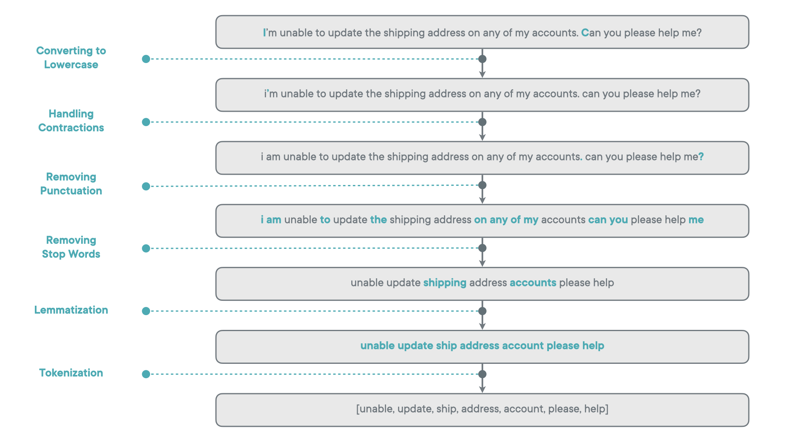
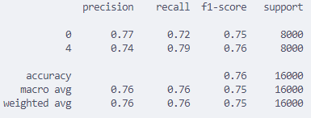
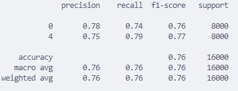
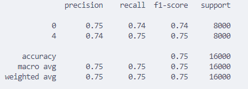
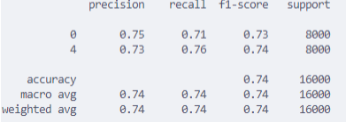

# Sensation
This program will analyze the tone of your text and determine whether it has a positive or negative tone.

## How to begin

Install the required dependecies

```
pip install -r requirements.txt
```

Run the following Streamlit command

```
streamlit run app.py
```


## Project Background
A random sample of 80,000 Training/Test data was obtained from [Sentiment140](https://cs.stanford.edu/people/alecmgo/trainingandtestdata.zip). Sentiment140 data consists of real life tweets from 2008. 

## Data Processing/Model Training
I used the below resources:
- [Comprehensive Guide: Creating an ML-Based Text Classification Model](https://www.atlantbh.com/creating-an-ml-based-text-classification-model/#:~:text=After%20evaluating%20the%20strengths%20and,choice%20for%20text%20classification%20tasks)
- [Sentiment Analysis on Twitter Posts](https://dev.to/profilsoftware/sentiment-analysis-on-twitter-posts-3j82)

### Data Cleaning
The functions that operate this process can be found in `Data_Process` directory. The below image shows a overall process for data cleaning


Lemmatization was used instead of Stemming as Lemmatization consideres the word context and part of speech, resutling in more precise transformations and valid words. However the downside is that it is more computationally expensive.

For vectorizers `Word2vec` and `BERT` (not a vectorizer) were considered; however, I stuck with `TFIDvectorizer` because: 
1. I am doing a simple sentiment analysis (positive/negative), so doing semantic analysis would be overengineering, and with my Sentiment140 data there simply wouldn’t be enough data to train on it. 
2. Fine tuning and extra training are required. “Word2vec” and “BERT” are computationally expensive, so they would not fit my current resource constraints, and fine-tuning is required.

### ML Model
Between the countless ML models, I choose the Support Vector Machine (SVM) because of SVM's strength in handling high-dimensional  data and determine the optimal hyperplane even when the data are not linerly separable using kernals (linear, rbf, poly, sigmoid). Additionally, a grid search for the optimal regularization value (C value) was performed (0.01,0.1,1,10) and the best regularization value returned to be C=1 (defualt). Below are the different analytics on the models:

Linear SVM Model (Training finished in 219.77057337760925 seconds)


RBF SVM Model (Training finished in 627.6614954471588 seconds)


POLY SVM Model (Training finished in 1147.7607135772705 seconds)


SIGMOID SVM Model (Training finished in 220.05506205558777 seconds)


The regularized model classification report are not included as C=1 is a defualt value.

The main metric to determine the performance of each model that I used as the F1-Score.

## Future Improvements
Future improvements would include allowing the user to train their own model and preventing the download of NLTK data everytime the program is runned. Preventing NLTK data to be checked would lower resource usage and decrease uptime when running streamlit.